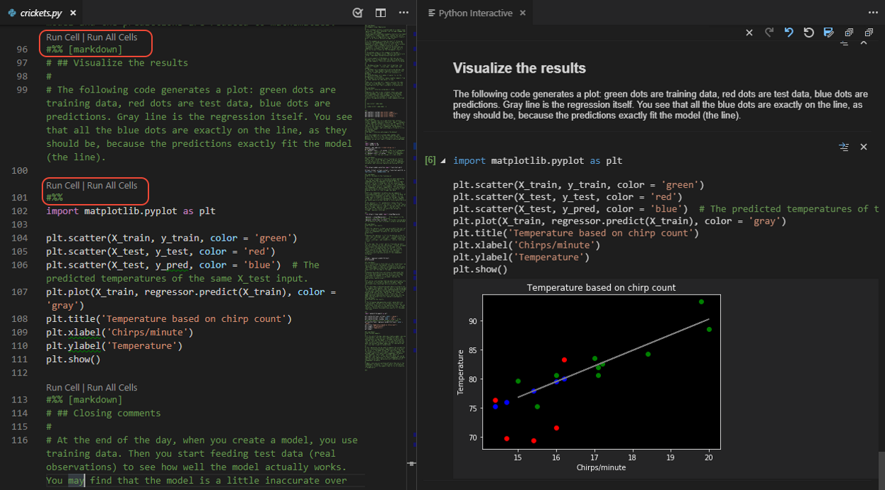

---
jupyter:
  ipub:
    language: british
    toc: true
    listcode: true
    listfigures: true
    listtables: true
    titlepage:
      author: Chris Sewell
      email: chrisj\_sewell@hotmail.com
      logo: _static/logo_example.png
      title: Example of Converted Jupyter Notebook 
      subtitle: Formatting Code Cells
      tagline: Converted using IPyPublish.
      supervisors:
      - First Supervisor
      - Second Supervisor
      institution:
      - Institution1
      - Institution2
    pandoc:
      convert_raw: true 
      at_notation: true
      use_numref: true
  jupytext:
    metadata_filter:
      notebook: ipub
    text_representation:
      extension: .Rmd
      format_name: rmarkdown
      format_version: '1.0'
      jupytext_version: 0.8.6
  kernelspec:
    display_name: Python 3
    language: python
    name: python3
---

.. _code_cells:

# Writing Code and Formatting Output

IPyPublish utilises metadata to to mark-up the notebook with information on
how output should be represented in the converted notebook,
as shown in :numref:`fig:mpl1`.

```{python ipub={'figure': {'caption': 'This is a Matplotlib figure, with a caption, a label and a set width', 'label': 'fig:mpl1', 'width': 0.4}}}
# %matplotlib inline
import matplotlib.pyplot as plt
import numpy as np
plt.plot(np.sin(np.linspace(0, 6)))
plt.show()
```

.. seealso::

    :ref:`metadata_tags`, for a full description and list of ipypublish metadata

.. _jupytext_python:

## Converting Notebooks to Pure Python

To write code, we can work in the conventional Jupyter Notebook environment,
or we can use [jupytext](https://github.com/mwouts/jupytext),
to convert between a notebook and the pure python
[percent format](https://github.com/mwouts/jupytext#the-percent-format)

```console
$ jupytext --to py:percent notebook.ipynb
$ jupytext --to notebook notebook.py            # overwrite notebook.ipynb
$ jupytext --to notebook --update notebook.py   # update notebook.ipynb
```

This will produce a standard python file,
with commented notebook level metadata commented at the top (in YAML format),
and each cell beginning with ``#%%`` (known as the percent format):

The percent format can be utilised in IDEs, such as
[Spyder](https://docs.spyder-ide.org/editor.html#defining-code-cells),
[Atom](https://atom.io/packages/hydrogen),
[PyCharm](https://www.jetbrains.com/pycharm/), and
[VS Code](https://code.visualstudio.com/docs/python/jupyter-support),
to run individual cells:

{#fig:vscode_py width=60%}

.. important::

    To preserve ipypublish notebook metadata, you must add:
    `"jupytext": {"metadata_filter": {"notebook": "ipub"}}` to
    your notebooks metadata before conversion.

.. seealso::

    :ref:`jupytext_rmarkdown`

    [Using YAML metadata blocks in Pandoc](https://pandoc.org/MANUAL.html#extension-yaml_metadata_block).

## NB Setup Helper Functions

:py:mod:`ipypublish.scripts.nb_setup` offers a number of useful functions,
to setup common packages (matplotlib, pandas, etc) for outputting content
in high quality formats.

```{python init_cell=TRUE, slideshow={'slide_type': 'skip'}}
from ipypublish import nb_setup
```

.. note::

    `ipypublish.scripts.ipynb_latex_setup` is deprecated in v0.9

## Text Output

```{python ipub={'text': {'format': {'backgroundcolor': '\\color{blue!10}'}}}}
print("""
This is some printed text,
with a nicely formatted output.
""")
```

## Images (with PIL)

```{python init_cell=TRUE, slideshow={'slide_type': 'skip'}}
import os
from ipypublish.tests import TEST_FILES_DIR
example_pic = os.path.join(TEST_FILES_DIR, 'example.jpg')
```

```{python ipub={'figure': {'caption': 'Horizontally aligned images.', 'label': 'fig:example_h', 'widefigure': False}}}
nb_setup.images_hconcat([example_pic, example_pic],
               width=600, gap=10)
```

```{python ipub={'slide': 'new', 'figure': {'caption': 'Vertically aligned images.', 'label': 'fig:example_v', 'widefigure': False}}}
nb_setup.images_vconcat([example_pic, example_pic],
               height=400, gap=10)
```

```{python ipub={'slide': 'new', 'figure': {'caption': 'Images aligned in a grid.', 'label': 'fig:example_grid', 'widefigure': False}}}
nb_setup.images_gridconcat([[_,_] for _ in [example_pic, example_pic]],
               height=300, vgap=10,hgap=20)
```

## Plots (with Matplotlib)

A matplotlib figure (+@fig:example_mpl{}), and its code (+@code:example_mpl{}).

```{python ipub={'code': {'asfloat': True, 'caption': 'The plotting code for a matplotlib figure (\cref{fig:example_mpl}).', 'label': 'code:example_mpl', 'widefigure': False}, 'figure': {'caption': 'A matplotlib figure', 'label': 'fig:example_mpl', 'widefigure': False, 'width': 0.7}}}
plt = nb_setup.setup_matplotlib(output=('pdf','svg'))
plt.scatter(np.random.rand(10), np.random.rand(10),
            label='data label')
plt.ylabel(r'a y label with latex $\alpha$')
plt.legend();
```

.. note::

    If outputting the Matplotlib figures in a PDF format.
    See [usetex tutorial](https://matplotlib.org/users/usetex.html#usetex-tutorial), 
    and [Stackoverflow question](https://stackoverflow.com/questions/38731201/latex-escaping-in-matplotlib).

## Tables (with pandas)

A pandas table (+@tbl:example_pd{}), and its code (+@code:example_pd{}).

```{python ipub={'code': {'asfloat': True, 'caption': 'The plotting code for a pandas Dataframe table (\cref{tbl:example_pd}).', 'label': 'code:example_pd', 'placement': 'H', 'widefigure': False}, 'table': {'alternate': 'gray!20', 'caption': 'An example of a table created with a pandas dataframe.', 'label': 'tbl:example_pd', 'placement': 'H'}}}
pd = nb_setup.setup_pandas(escape_latex=False)
df = pd.DataFrame(np.random.rand(3,4),columns=['a','b','c','d'])
df.a = ['$\delta$','x','y']
df.b = ['l','m','n']
df.set_index(['a','b'])
df.round(3)
```

.. note::

    If using `escape_latex=False`, then PDF conversion will throw an error 
    if there are e.g. `_`'s in your column names. You either need to escape
    these manually (`\_`) or use `escape_latex=True`. But note that, 
    `escape_latex=True` will also escape math (e.g. `$\delta$`) causing it not
    to render.

# Equations (with ipython or sympy)

```{python ipub={'equation': {'label': 'eqn:example_ipy'}}}
from IPython.display import Latex
Latex('$$ a = b+c $$')
```

```{python ipub={'code': {'asfloat': True, 'caption': 'The plotting code for a sympy equation \eqref{eqn:example_sympy}.', 'label': 'code:example_sym', 'placement': 'H', 'widefigure': False}, 'equation': {'label': 'eqn:example_sympy', 'environment': 'equation'}}}
sym = nb_setup.setup_sympy()
f = sym.Function('f')
y,n = sym.symbols(r'y \alpha')
f = y(n)-2*y(n-1/sym.pi)-5*y(n-2)
sym.rsolve(f,y(n),[1,4])
```
