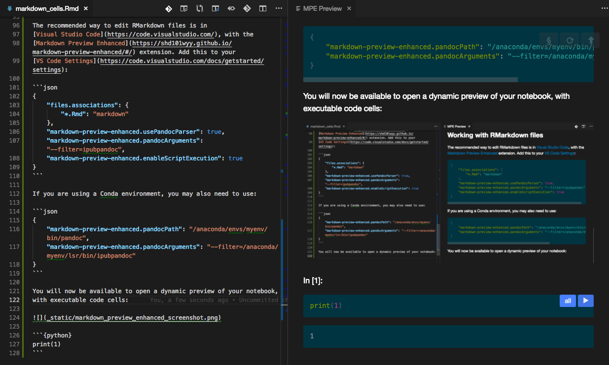

---
jupyter:
  ipub:
    language: british
    toc: true
    listcode: true
    listfigures: true
    listtables: true
    titlepage:
      author: Chris Sewell
      email: chrisj\_sewell@hotmail.com
      logo: _static/logo_example.png
      title: Example of Converted Jupyter Notebook
      subtitle: Formatting Markdown Cells
      tagline: Converted using IPyPublish ('latex\_ipypublish\_all.exec').
      supervisors:
      - First Supervisor
      - Second Supervisor
      institution:
      - Institution1
      - Institution2
    pandoc:
      convert_raw: true
      hide_raw: false
      at_notation: true
      use_numref: true
    bibliography: _static/example.bib
    bibglossary:
      filepath: _static/other_glossary.bib
    sphinx:
      no_bib: false
      no_glossary: false
      bib_title: Bibliography
      glossary_title: Glossary
  jupytext:
    metadata_filter:
      notebook: ipub
    text_representation:
      extension: .Rmd
      format_name: rmarkdown
      format_version: '1.0'
      jupytext_version: 0.8.6
  kernelspec:
    display_name: Python 3
    language: python
    name: python3
---

.. _markdown_cells:

# Writing Markdown

In IPyPublish, all Markdown content is converted *via* [Pandoc](https://pandoc.org/).
[Pandoc](https://pandoc.org/) alllows for [filters](https://pandoc.org/filters.html)
to be applied to the intermediary representation of the content,
which IPyPublish supplies through a group of
[panflute](http://scorreia.com/software/panflute/) filters,
wrapped in a single 'master' filter; `ipubpandoc`.
This filter extends the common markdown syntax to:

- Correctly translate pieces of documentation written in other formats
  (such as using LaTeX commands like `\cite` or RST roles like `:cite:`)
- Handle labelling and referencing of figures, tables and equations, and
  add additional formatting options.

`ipubpandoc` is detached from the rest of the
notebook conversion process, and so can be used as a standalone process on any markdown content:

```console
$ pandoc -f markdown -t html --filter ipubpandoc path/to/file.md
```

.. seealso::

    [The PDF representation of this notebook](_static/markdown_cells.pdf)

    :ref:`pandoc_doc_metadata`, for the notebook document level metadata options.

.. _jupytext_rmarkdown:

## Converting Notebooks to RMarkdown

RMarkdown is a plain text representation of the workbook.
Thanks to [jupytext](https://github.com/mwouts/jupytext), we can easily
convert an existing notebooks to RMarkdown (and back):

```console
$ jupytext --to rmarkdown notebook.ipynb
$ jupytext --to notebook notebook.Rmd            # overwrite notebook.ipynb (remove outputs)
$ jupytext --to notebook --update notebook.Rmd   # update notebook.ipynb (preserve outputs)
```

Alternatively, simply create a notebook.Rmd,
and add this to the top of the file:

```yaml
---
jupyter:
  ipub:
    pandoc:
      convert_raw: true
      hide_raw: false
      at_notation: true
      use_numref: true
  jupytext:
    metadata_filter:
      notebook: ipub
    text_representation:
      extension: .Rmd
      format_name: rmarkdown
      format_version: '1.0'
      jupytext_version: 0.8.6
  kernelspec:
    display_name: Python 3
    language: python
    name: python3
---
```

.. important::

    To preserve ipypublish notebook metadata, you must add:
    `{"jupytext": {"metadata_filter": {"notebook": "ipub"}}}` to
    your notebooks metadata before conversion.

.. note::

    If a file with a .Rmd extension is supplied to
    `nbpublish`, it will automatically call `jupytext` and convert it.
    So it is possible to only ever write in the RMarkdown format!

.. seealso::

    [Using YAML metadata blocks in Pandoc](https://pandoc.org/MANUAL.html#extension-yaml_metadata_block).

    :ref:`jupytext_python`


## Working with RMarkdown files

The recommended way to edit RMarkdown files is in
[Visual Studio Code](https://code.visualstudio.com/), with the
[Markdown Preview Enhanced](https://shd101wyy.github.io/markdown-preview-enhanced/#/) extension. Add this to your
[VS Code Settings](https://code.visualstudio.com/docs/getstarted/settings):

```json
{
    "files.associations": {
        "*.Rmd": "markdown"
    },
    "markdown-preview-enhanced.usePandocParser": true,
    "markdown-preview-enhanced.pandocArguments": "--filter=ipubpandoc",
    "markdown-preview-enhanced.enableScriptExecution": true
}
```

If you are using a Conda environment, you may also need to use:

```json
{
    "markdown-preview-enhanced.pandocPath": "/anaconda/envs/myenv/bin/pandoc",
    "markdown-preview-enhanced.pandocArguments": "--filter=/anaconda/myenv/lsr/bin/ipubpandoc"
}
```

You will now be able to open a dynamic preview of your notebook,
with executable code cells:

{#mpe}

```{python}
print(1)
```

.. seealso::

    VS Code Extensions: [Markdown Extended](https://marketplace.visualstudio.com/items?itemName=jebbs.markdown-extended) and
    [markdownlint](https://marketplace.visualstudio.com/items?itemName=DavidAnson.vscode-markdownlint)

## Inter-Format Translation

`ipubpandoc` attempts to detect any segments of documentation written in
[LaTeX](https://www.latex-project.org/about/) or
[Sphinx reStructuredText](http://www.sphinx-doc.org/en/master/usage/restructuredtext/basics.html) (and HTML citations), and convert them into
a relevant [panflute element](http://scorreia.com/software/panflute/code.html).

Because of this we can write something like this:

```md
- citations in @ notation [@zelenyak_molecular_2016; @kirkeminde_thermodynamic_2012]
- citations in rst notation :cite:`zelenyak_molecular_2016,kirkeminde_thermodynamic_2012`
- citations in latex notation \cite{zelenyak_molecular_2016,kirkeminde_thermodynamic_2012}
- citation in html notation <cite data-cite="kirkeminde_thermodynamic_2012">text</cite>

$$a = b + c$$ {#eqnlabel}

- a reference in @ notation =@eqnlabel {.capital}
- a reference in rst notation :eq:`eqnlabel`
- a reference in latex notation \eqref{eqnlabel}

.. note::

    a reference in latex notation within an RST directive \eqref{eqnlabel}

```

and it will be correctly resolved in the output document:

- citations in @ notation [@zelenyak_molecular_2016; @kirkeminde_thermodynamic_2012]
- citations in rst notation :cite:`zelenyak_molecular_2016,kirkeminde_thermodynamic_2012`
- citations in latex notation \cite{zelenyak_molecular_2016,kirkeminde_thermodynamic_2012}
- citation in html notation <cite data-cite="kirkeminde_thermodynamic_2012">text</cite>

$$a = b + c$$ {#eqnlabel}

- a reference in @ notation =@eqnlabel {.capital}
- a reference in rst notation :eq:`eqnlabel`
- a reference in latex notation \eqref{eqnlabel}

.. note::

    a reference in latex notation within an RST directive \eqref{eqnlabel}

Inter-format translation is turned on by default, but if you wish to turn it
off, or hide it, simply add to the document metadata:

```yaml
jupyter:
  ipub:
    pandoc:
      convert_raw: true
      hide_raw: false
```

## Labelling, Formatting and Referencing Figures, Tables and Equations

`ipubpandoc` allows for figures, tables, equations and references to be
supplied with an 'attribute container'. This is a braced section to the side
of the figures, equations, reference or table caption, that
parses on additional information to the formatter,
e.g. `{#id .class-name attribute1=10}`.

Attribute containers are turned on by default, but if you wish to turn them
off, simply add to the document metadata:

```yaml
jupyter:
  ipub:
    pandoc:
      at_notation: false
```

.. tip::

    Zero or more Space is generally allowed between the element and the attribute container.

### Figures

Figures can have an identifier and a width or height.
Additionally, `placement` will be used by LaTeX output.

```md
{#fig:example width=50% placement='H'}

@fig:example
```

{#fig:example width=50% placement='H'}

### Tables

Tables can have an identifier and relative widths (per column).
Additionally, `align` will be used by LaTeX and HTML to set the alignment of the columns (l=left, r=right, c=center)

Column 1 Column 2
-------- --------
1          2

Table: Table caption {#tbl:example align=rc widths=[0.5,0.5]}

### Equations

Equations can have an identifier and an `env` denoting the
[amsmath environment](https://www.overleaf.com/learn/latex/Aligning_equations_with_amsmath).

```md
$$2x &=  8 \\ 3x + 9y &= -12$$ {#eqn:example2 env=align}
```

$$2x &=  8 \\ 3x + 9y &= -12$$ {#eqn:example2 env=align}

.. note::

    Labelled math must be 'display math', rather than inline, i.e. wrapped in double dollars.

.. _markdown_references:

### References

Pandoc references are denoted by ``@``, with an optional prefix, and multiple references can be wrapped in square brackets:

```md
Citation [@zelenyak_molecular_2016; @kirkeminde_thermodynamic_2012]

Glossary Terms: %@gtkey2, &@akey2, &@symbol2
```

Citation [@zelenyak_molecular_2016; @kirkeminde_thermodynamic_2012]

Glossary Terms: %@gtkey2, &@akey2, &@symbol2

.. note::

    Citations in sphinx are provided by the excellent
    [sphinxcontrib-bibtex extension](https://sphinxcontrib-bibtex.readthedocs.io),
    and glossary referencing is provided by the equally good :ref:`sphinx_ext_gls`

References can have attributes; `latex` (defining the LaTeX tag to use),
`rst` (defining the RST role to use) and class `.capital` (defining if HTML naming is capitalized)

```md
@fig:example {.capital latex=cref rst=numref}, [@eqnlabel;@eqn:example2] {latex=eqref rst=eq}
```

@fig:example {.capital latex=cref rst=numref}, [@eqnlabel;@eqn:example2] {latex=eqref rst=eq}

A number of prefixes are available, as shorthand's to define attributes:

prefix attribute
------ -----------------------
""     {latex=cite rst=cite}
"+"    {latex=cref rst=numref}
"!"    {latex=ref rst=ref}
"="    {latex=eqref rst=eq}
"?"    {.capital latex=Cref rst=numref}
"&"    {latex=gls rst=gls}
"%"    {.capital latex=Gls rst=glsc}

Table: Prefixes for reference attributes {#tbl:prefixes}

```md
?@fig:example, =[@eqnlabel;@eqn:example2]
```

?@fig:example, =[@eqnlabel;@eqn:example2]

.. tip::

    Pandoc interprets `(@label)` as a [numbered example](https://pandoc.org/MANUAL.html#numbered-example-lists), so instead use `(@label{})`

## A Note on Implementation

To assign attributes to items, we use a preparation filter, to extract prefixes and attributes, and wrap the items in a Span containing them.
For example:

```md
$$a=1$$ {#a env=align}
```

will be transformed to:

```html
<p>
<span id="a" class="labelled-Math" data-env="align">
<br />
<span class="math display">
<em>a</em> = 1
</span>
<br />
</span>
</p>
```

and

```md
"+@label{ .class a=1} xyz *@label2* @label3{ .b}"
```

will be transformed to:

```html
<p>
<span class="attribute-Cite class"
data-latex="cref" data-rst="numref" data-a="1">
<span class="citation" data-cites="label">
@label
</span></span>
xyz
<em><span class="citation" data-cites="label2">
@label2
</span></em>
<span class="attribute-Cite b">
<span class="citation" data-cites="label3">
@label3
</span></span>
</p>
```

Formatter filters, then look for these parent spans,
to provide identifiers, classes and attributes.
